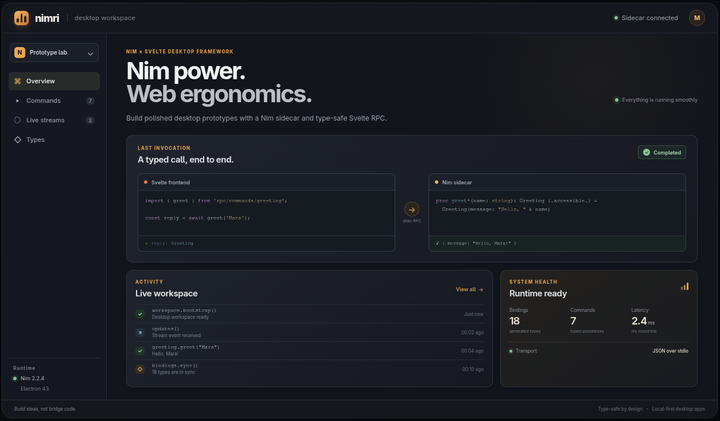

# Nim-Svelte Electron Desktop Framework


This project was created to make it fast and enjoyable to build good-looking desktop application. Tauri already solves this problem, BUT Rust's compile-time guarantees and feedback loop can add friction when the main goal is exploring an idea quickly.

To be clear, I am still figuring out where this project will go. For now, it is a foundation for exploring a simple and productive way to build desktop applications.

## Quick start

Install the frontend dependencies and start the app:

```sh
nimble install
npm install
npm run dev
```

The development command generates the bindings, compiles the Nim sidecar, starts
Vite and Electron, and opens the desktop window. Closing the window stops Vite,
Electron, and the sidecar. For a release build, run:

```sh
npm run build
```

The native build output is a directly runnable Electron application directory
below `bin/`, such as `bin/Nimri-linux-x64/` on Linux or
`bin/Nimri-win32-x64/` on Windows. No installer is created. The package contains
the compiled Svelte assets, the Electron runtime, the Nim sidecar, and, on
Windows, the required MinGW runtime DLLs.

## Runtime architecture

Electron owns the application lifecycle, the single desktop window, and
frontend asset delivery. In development it loads Vite from
`http://127.0.0.1:5173`; a packaged app serves its assets through the internal
`nimri://app/` protocol. The renderer runs sandboxed, without Node.js
integration, and can access only the typed `window.nimri` methods exposed by the
isolated preload script.

Electron starts one bundled Nim sidecar in its internal `serve` mode. RPC uses
newline-delimited JSON over the process's standard input and output; Nimri does
not open a bridge port. Protocol output is reserved for RPC messages, while
backend logs go to standard error. Closing the app closes the sidecar input and
cancels active streams. If the sidecar exits unexpectedly, pending calls and
streams fail and Electron shuts down cleanly.

## Included showcase

The running app is a single minimal showcase in `backend/features/showcase/`.
It demonstrates three generated, fully typed RPC shapes:

- `frameworkInfo()` is an immediate command returning `ShowcaseOverview` with
  application and transport information.
- `loadOverview()` returns `Future[ShowcaseOverview]`; its short delay makes the
  frontend loading, success, and error states visible.
- `streamActivity()` returns `FutureStream[ActivityEvent]`. Each event contains
  an `ActivityPhase` enum, a message, and elapsed time.

The Svelte page imports those commands from `rpc/commands/showcase` and the
named contracts from `rpc/types`; it never builds a transport request itself.
The activity stream is single-use and can be canceled while it is live. Nim
handles the resulting `ValueError` after an awaited `write`, so cancellation
stops the producer cleanly. The stream otherwise emits its finite sequence and
completes normally.

```nim
proc frameworkInfo*(): ShowcaseOverview {.accessible.}
proc loadOverview*(): Future[ShowcaseOverview] {.async, accessible.}
proc streamActivity*(): FutureStream[ActivityEvent] {.accessible.}
```

## Add a feature

Treat a feature as one vertical slice: define its RPC contracts in
`backend/features/<feature>/types.nim` and its accessible commands under
`commands/`. Then regenerate the TypeScript bindings:

```sh
npm run feature some-feature
npm run generate
```

Feature names use kebab-case. The scaffold creates an underscore-separated Nim
directory and asks whether to generate bindings. All command files below one
feature form a generated frontend module; the feature path is also its RPC
namespace. Keep frontend code on the generated APIs such as
`rpc/commands/showcase` and `rpc/types`.

## Development commands

```sh
npm run feature some-feature # Create a backend feature scaffold
npm run generate             # Regenerate frontend RPC bindings
npm run dev                  # Start the development workflow
npm run build                # Package a runnable Electron app below bin/
```

The same commands work on Linux and Windows, with builds produced natively on
their target platform. The explicit `npm run run` alias is also available,
along with `npm run serialize` and `npm test`.

## Supported RPC capabilities

- Normally named, non-generic procedures with explicit parameter types.
- Strings, booleans, numeric types, enums, `Option[T]`, sequences, fixed
  arrays, `Table[string, T]`, `OrderedTable[string, T]`, exported plain
  objects with exported fields, and exported named tuples.
- Synchronous commands and cooperative asynchronous commands returning
  `Future[T]`; generated frontend functions return promises.
- Streaming commands returning `FutureStream[T]`; generated frontend functions
  return a lazy `NimriStream<T>` that works with `for await...of`.

## Limitations

These limits require framework work rather than a local feature implementation.

| Limitation | Difficulty |
| --- | --- |
| References and pointers | Nearly impossible, because safe object identity, lifetime, and cyclic graphs need a separate resource model. |
| Generic command procedures | Challenging, because every frontend binding needs a concrete signature. |
| Object inheritance and variant objects | Challenging, because generated TypeScript needs a stable discriminator and complete subtype schema. |
| Positional tuples, non-string table keys, and object default fields | Feasible with explicit JSON encodings. |
| Integers outside JavaScript's safe range, `NaN`, and infinities | Challenging, because JSON and JavaScript `number` do not preserve them safely. |
| Automatic timeouts and resumable or multi-consumer streams | Challenging, because they need additional lifecycle and replay semantics. |

## Status

This is a focused framework for quickly shipping desktop prototypes. The API is intentionally small and opinionated, so feedback, bug reports, and small focused pull requests are welcome.

## AI Disclaimer

AI was used as an engineering tool, including for parts of the Nim macro implementation, while design decisions and the resulting code were reviewed with long-term maintainability in mind for HUMANS by me e.g. using mustache for template generation. I provide also my `AGENTS.md` and my `Agent Skills` for this project.
